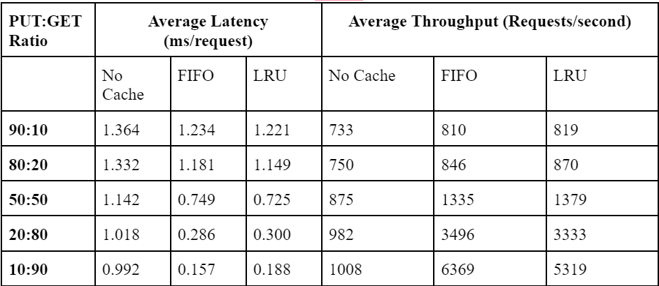

# ECE419-Distributed-Database-M1

## Overview

This project aims to create an interactive client-server system capable of storing and retrieving key-value pairs. To achieve this, Team 50 split the system into various modules, including the client-side application (KVClient), the functional client (KVStore), the client-server connection and communication module (ClientConnection and KVMessage together), the functional server (KVServer), the persistent database (KVDatabase), and the cache (FIFOCache and LRUCache).

## Client-side Application (CLI)

The CLI, as implemented with KVClient, is responsible for taking and parsing input from the user, as well as providing the response from the server. It instantiates the functional client module, KVStore, upon a new connection being made, and calls KVStore functions to handle various commands, like connect, disconnect, put, and get. All of its interactions with the server are done through KVStore. It is also responsible for instantiating and logging in the client logger.

## Messaging Protocol (KVMessage)

The messaging protocol, KVMessage, is responsible for handling the serialization and deserialization of get and put requests on both the client and server sides. KVMessage converts a request into a message string and encodes it into a byte array which is sent over a TCP connection. The end of a message is marked with the carriage return character followed by the newline character '\r\n'. Messages are of the form STATUS KEY VALUE, where STATUS is a string representing what type of request/response is being sent (e.g. GET, PUT, GET_ERROR, PUT_SUCCESS, etc.), and KEY and VALUE are strings representing the key and value of the request/response.

## Functional Client (KVStore Library

KVStore provides an API for the client-side application to interact with the KVServer. It implements methods responsible for sending get/put requests to the server, as well as receiving the associated response from the server. To do this, it also implements communication methods sendMessage and receiveMessage which send/read bytes from the client-server connection. These message bytes are then serialized/deserialized by KVMessage.

## Server Communication (ClientConnection)

ClientConnection is responsible for handling separate client connections to the server and is instantiated in a new Thread by the server after accepting a new client connection. It implements a method to resolve the client's requests by routing them to the appropriate KVServer methods, constructing a response message, and sending it back to the client. It also has methods responsible for reading and writing bytes from the client-server connection, and for closing the connection when the client disconnects. Due to their many similarities, the send and receive methods could have been implemented in a common communication module, but the client and server have different logging requirements, so it was decided to keep them separate.

## KVServer

The KVServer functions as the top level module to process client requests. The user instantiates the server with a port number, as well as additional optional parameters, including bind address, storage path and log information. The server instantiates a local KVDatabase and cache mechanism for it to manage. The module listens on the defined port for incoming client connections and generates a new ClientConnection thread to handle the request. KVServer also receives put and get requests and performs the appropriate calls to cache or KVDatabase to retrieve and send back values.

## KVDatabase

The system’s persistent storage architecture was implemented to enable concurrent reading and writing of key-value pairs to improve performance. Each pair is assigned a file in a user-defined or default path on the user’s machine. Files are written to and read from using Java FileChannels, which enable concurrent threads to perform non-modifying operations, such as reads, simultaneously, but block when a thread is altering a file. Open FileChannels are maintained in a Java ConcurrentHashMap, which enables each thread to check the same FileChannel before performing any operations. This architecture allows multiple threads with “GET” requests to retrieve values quicker than a single, locked system, yet also ensures that writes are mutually exclusive.

## Caching

Team 50 implemented two types of caches that differ by eviction strategy: First In First Out (FIFO), and Least Recently Used (LRU). The cache is instantiated with KVServer and interacts solely with this module. Both these caches were implemented using Synchronized LinkedHashMap and Java’s predefined cache structure, which supports both FIFO and LRU eviction.

## Testing

JUnit testing was used to ensure the validity of the design, with over 39 additional tests being added to the provided test suite, which has a total of 48 tests. These include both interaction tests and tests for each of our modules individually. The following functionality is tested (excluding that from the provided tests): client command line response, server command line response, gets/puts through KVClient after server shutdown and reconnection, message encoding and decoding, get/put/delete/clear/update commands in the database, gets/puts in each cache, interaction between client requests and cache, and interaction of multiple clients with the server and database. The system successfully passed all tests.

## Performance

To evaluate the latency and throughput of the system, different ratios of get and put calls were applied on a single client thread on the Linux machines, with one hundred total calls per execution and a fixed cache size of 40 entries. The average performance results over ten trials are presented in Figure 1, which demonstrate a decrease in latency as the number of read calls increase, as well as a decrease with different caching implemented. This difference becomes more significant as the put:get ratio is decreased, since a majority of gets are served by the cache.

Figure 1: Average Latency and Throughput of storage system with different cache strategies